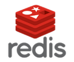

# Data Engineer 12.0 /  NewProLab / Spring 2023

### Источник

Сайт: [New Professions Lab](https://newprolab.com/#programmes)

### Практика

## Лаба 1. + 1s. [Настройка инфраструктуры + kafka-брокер](https://github.com/vi-bo/big_data/tree/main/de-12/lab1s)

### Задачи

* поднять две машины в VK Cloud с заданной конфигурацией;

* настроить порты в сети облака, подключиться к машинам по ssh;

* сконфигурировать группу правил доступа для внутрикластерного общения;

* установить Kafka, Zookeeper;

* настроить Firewall на уровне OS.

### Инструменты

## Лаба 2. [Batch обработка данных e-commerce платформы](https://github.com/vi-bo/big_data/tree/main/de-12/lab2)

В лабе 2 и 3 делаем lambda-архитектуру с двумя слоями (batch-слоем и speed-слоем). В лабе 2 соответственно делаем batch-слой.

### Задачи

* установка и конфигурирование Сlickhouse;

* установка и конфигурирование Airflow;

* создание таблицы и материализованного представления в Clickhouse для получения и хранения в "сыром виде" данных из кафки, а также для хранения агрегированных по часам данных;

* проверка работы REST API Сlickhouse, Airflow;

* написать скрипт, который на основе сырых данных считает агрегаты и сохранит результат в нужную таблицу в Clickhouse;

* создание DAG Airflow, который запускает скрипт из предыдущего пункта;

* настройка пайплайна, чтобы чекер мог запускать DAG через REST API Airflow.

### Инструменты

## Лаба 3. [Realtime обработка данных e-commerce портала](https://github.com/vi-bo/big_data/tree/main/de-12/lab3)

В лабе 2 и 3 делаем lambda-архитектуру с двумя слоями (batch-слоем и speed-слоем). В лабе 3 соответственно делаем speed-слой.

### Задачи

* установка Spark на VK Cloud / hadoop-кластере;

* проверка работоспособности Spark Streaming;

* проверка чтения/записи в топик Kafka;

* написать заготовку pyspark-джобы и скрипт для ее запуска;

* стриминг-расчёт метрик e-commerce платформы.

### Инструменты

## Лаба 3s. [Загрузка данных и построение витрин](https://github.com/vi-bo/big_data/tree/main/de-12/lab3s)

В лабе 2 и 3 делаем lambda-архитектуру с двумя слоями (batch-слоем и speed-слоем). В лабе 3 соответственно делаем speed-слой.

### Задачи

* создать базу данных и таблицы в Hive на hadoop-кластер;

* загрузить данные из Postgres спомощью Sqoop;

* построить датамарт в соответсивии с заданным условием.

### Инструменты

## Лаба 4. [Web-сервис как data-product](https://github.com/vi-bo/big_data/tree/main/de-12/lab4)

В лабе 2 и 3 мы сделали lambda-архитектуру с двумя слоями (batch-слоем и speed-слоем). В лабе 4 делаем "сервис-слой".

### Задачи

* сделать топик Kafka для приема данных;

* загрузить данные из Kafka в ClickHouse с возможностью дозаписи новых данных;

* сделать микро-сервис на Flask;

* упаковать веб-сервис в Docker-контейнер.

### Инструменты

## Лаба 4s. [Дашборды, бизнесовые и опсовые](https://github.com/vi-bo/big_data/tree/main/de-12/lab4s)

Добавляем дашборды в сервис.

### Задачи

* взять данные из Clickhouse, сделать BI-аналитику с помощью Apache Superset;

* визуализация метрик Flask-приложения в Prometheus.

### Инструменты

## Лаба 5. [Пайплайн персонализации для интернет-магазина](https://github.com/vi-bo/big_data/tree/main/de-12/lab5)

Сбор данных из нескольких источников, обогащение данных маппингом товар-категория из Postgres DB, расчет почасовых агрегатов по категориям и пользователям, сохранение результатов в Redis.

### Задачи

* развернуть новый Airflow и Redis в docker-контейнере;

* docker-compose для Airflow;

* загрузка данных кликстрима в Сlickhouse;

* exploratory data analysis (EDA) / предварительный анализ данных через DBeaver;

* распарсить дерево каталога товаров, обогатить данные кликстрима;

* DAG-обработчик для Airflow;

* расчет общих часовых характеристик по всем пользователям для категорий второго уровня (топ-5 добавленных в favorites);

* расчет персональных часовых данных пользователя для категорий третьего уровня (топ-10 просмотренных категорий, топ-5 добавленных в favorites);

* сохранить результаты в Redis.

### Инструменты

## Шпаргалка

| Основные команды                                                                                                                | Описание                                                                                                                                                                      |
| ------------------------------------------------------------------------------------------------------------------------------- | ----------------------------------------------------------------------------------------------------------------------------------------------------------------------------- |
| **ssh**                                                                                                                         |                                                                                                                                                                               |
| `ssh -i ./имя_файла_ключа.pem ubuntu@ip_адрес_удаленной_машины`                                                                 | подключение к удаленной машине по ключу (файл .pem должен лежать в папке .ssh)                                                                                                |
| `exit` , `logout` или `ctrl`+`d`                                                                                                | выход из терминала удаленной машины                                                                                                                                           |
| `chmod 600 имя_файла_ключа.pem`                                                                                                 | изменение прав доступа для файла ключа, иначе данные будут считаться слишком открытыми                                                                                        |
| `host de-vi-bo-cn-1`                                                                                                            | после доступа в консоль удаленной машины - проверка доступа к удаленной машине по имени (ответ de-vi-bo-cn-1.mcs.local has address ip_адрес), первая машина была с внешним ip |
| `scp ./имя_файла_ключа.pem de12-cn-1:.ssh/id_rsa`                                                                               | копирование файла ключа на удаленную машину в файл id_rsa (имя машины для доступа на de12-cn-1 поменял в файле config, папка .ssh)                                            |
| `scp /home/vibo/*.csv de12-cn-1:/home/ubuntu/`                                                                                  | копирование всех файлов типа csv на удаленную машину                                                                                                                          |
| **firewall**                                                                                                                    |                                                                                                                                                                               |
| `sudo ufw allow номер_порта/tcp`                                                                                                | разрешить доступ к порту                                                                                                                                                      |
| `sudo ufw reload`                                                                                                               | перезагрузка firewall                                                                                                                                                         |
| **linux/ubuntu**                                                                                                                |                                                                                                                                                                               |
| `wget https://путь_до_архива/имя_архива.tgz`                                                                                    | скачать файл по прямой ссылке                                                                                                                                                 |
| `tar xzvf имя_архива.tgz`                                                                                                       | разархиварировать архив в текущий каталог                                                                                                                                     |
| **venv**                                                                                                                        |                                                                                                                                                                               |
| `python3 -m venv имя`                                                                                                           | создание нового виртуального окружения                                                                                                                                        |
| `source имя/bin/activate`                                                                                                       | активация виртуального окружения                                                                                                                                              |
| **systemctl**                                                                                                                   |                                                                                                                                                                               |
| `sudo systemctl status имя_сервиса`                                                                                             | проверка работоспособности сервиса                                                                                                                                            |
| `sudo systemctl stop имя_сервиса`                                                                                               | остановка сервиса                                                                                                                                                             |
| `sudo systemctl disable имя_сервиса`                                                                                            | удаление сервиса из автозагрузки                                                                                                                                              |
| `pip freeze > requirements.txt`                                                                                                 | сохранение файла с зависимостями                                                                                                                                              |
| **clickhouse**                                                                                                                  |                                                                                                                                                                               |
| `clickhouse+native://адрес:9090/default`                                                                                        | подключение к открытой базе данных (default)                                                                                                                                  |
| `sudo clickhouse-client --9090 `                                                                                                | запуск клиента                                                                                                                                                                |
| `show tables`                                                                                                                   | перечень созданных таблиц                                                                                                                                                     |
| `sudo mv /home/ubuntu/имя_файла.jsonl /var/lib/clickhouse/user_files/имя_файла.jsonl`                                           | перенос файла в рабочий каталог (иначе было не создать таблицу из этого файла)                                                                                                |
| `sudo clickhouse-client --port 9090 --multiline --query="CREATE TABLE имя_таблицы ENGINE=File(JSONEachRow, 'имя_файла.jsonl')"` | создание таблицы из файла формата jsonl                                                                                                                                       |
| `select count(*) from имя_таблицы;`                                                                                             | проверка количества записей в таблице                                                                                                                                         |
| `select * from имя_таблицы limit 10;`                                                                                           | прсомотр 10 записей таблицы                                                                                                                                                   |
| `select имя_колонки_1, имя_колонки_2, timestamp, toDateTime(timestamp) as time_stamp from имя_таблицы limit 10;`                | преобразование столбца `timestamp` к времени и дате, с выводом 10 записей                                                                                                     |
| `drop table имя_таблицы`                                                                                                        | удаление таблицы                                                                                                                                                              |
| **airflow**                                                                                                                     |                                                                                                                                                                               |
| `airflow users create -r Admin -u admin -f Vi -l Bo -e vi.bo7@ya.ru -p '***pass***'`                                            | создание пользователя бд airflow (в контейнере airflow)                                                                                                                       |
| **docker**                                                                                                                      |                                                                                                                                                                               |
| `sudo docker exec -it номер_контейнера bash`                                                                                    | войти в bash контейнера (вместо bash может )                                                                                                                                  |
| `sudo docker image rm номер_образа`                                                                                             | удаление образа контейнера                                                                                                                                                    |
| `sudo docker build --tag имя_образа .`                                                                                          | сборка/пересборка образа в текущей дирректории                                                                                                                                |
| **docker-compose**                                                                                                              |                                                                                                                                                                               |
| `sudo apt-get install docker-compose-plugin`                                                                                    | установка                                                                                                                                                                     |
| `docker compose version`                                                                                                        | проверка версии                                                                                                                                                               |
| `sudo docker compose up`                                                                                                        | запуск файла docker-compose.yml                                                                                                                                               |
| `docker-compose exec имя_контейнера bash`                                                                                       | войти в bash контейнера (не работало)                                                                                                                                         |
| `sudo docker-compose -f имя_файла.yml up`                                                                                       | запуск контейнера с приложением                                                                                                                                               |
| `sudo docker-compose -f имя_файла.yml down`                                                                                     | остановка контейнера с приложением                                                                                                                                            |
| **redis**                                                                                                                       |                                                                                                                                                                               |
| `redis-cli`                                                                                                                     | вход в клиент                                                                                                                                                                 |
| `ping`                                                                                                                          | проверка работы (ответ - `PONG`)                                                                                                                                              |
| `zrange имя_ключа 0 -1 withscores`                                                                                              | проверка записей по ключу                                                                                                                                                     |
| `flushall`                                                                                                                      | полная очистка базы данных                                                                                                                                                    |
| `exit`                                                                                                                          | выход                                                                                                                                                                         |
| **superset**                                                                                                                    |                                                                                                                                                                               |
| `http://адрес:8088/superset/welcome/`                                                                                           | стартовая страница, регистрация по умолчанию admin/admin                                                                                                                      |
